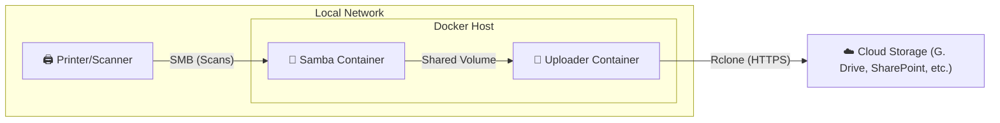

# 🖨️ smb2drive (Multi-Cloud)


**smb2drive** is a lightweight, Docker-based bridge that seamlessly connects your network scanner/printer to Google Drive, Microsoft SharePoint, OneDrive, and more. It emulates a Windows File Server (SMB) to receive scans and automatically uploads them to your preferred cloud storage using `rclone`.

---

## 🏗️ Architecture


```mermaid
graph LR
    subgraph Local Network
        Printer[🖨️ Printer/Scanner]
        subgraph Docker Host
            SMB[📂 Samba Container]
            Uploader[🚀 Uploader Container]
        end
    end
    Cloud["☁️ Cloud Storage (G. Drive, SharePoint, etc.)"]

    Printer -- SMB (Scans) --> SMB
    SMB -- Shared Volume --> Uploader
    Uploader -- Rclone (HTTPS) --> Cloud
```

## 🚀 Features

-   **Drop & Forget**: Scans saved to the folder are instantly uploaded.
-   **Multi-Cloud Support**: Connect to **Google Drive**, **Microsoft SharePoint**, **OneDrive**, and others thanks to `rclone` capabilities.
-   **Zero Maintenance**: Runs quietly in the background with Docker.
-   **Secure**: Uses `rclone` for secure, encrypted transfers.

## 📋 Prerequisites

-   **Docker** & **Docker Compose** installed.
-   An account with your preferred Cloud provider (Google, Microsoft, etc.).

## 🛠️ Installation

1.  **Clone the repository**
    ```bash
    git clone https://github.com/gustavomaceu/smb2drive.git
    cd smb2drive
    ```

2.  **Configure Cloud Storage Access**
    You need to authorize the application to access your cloud storage.
    1.  Install `rclone` on your machine (or use a temp container).
    2.  Run `rclone config`.
    3.  Create a new remote and you **MUST** name it **`remote`**:
        
        **For Microsoft SharePoint / OneDrive:**
        -   **Type**: `onedrive`
        -   Leave *client_id* and *client_secret* blank.
        -   Authenticate when prompted.
        -   Choose your endpoint (e.g., `Sharepoint` or `OneDrive`).
        
        **For Google Drive:**
        -   **Type**: `drive`
        -   **Shared Drive**: Answer **y** if using a Team Drive.
        
    4.  Copy the generated `rclone.conf` to the project:
        ```bash
        mkdir -p config
        cp /path/to/rclone.conf ./config/rclone.conf
        ```

3.  **Start the Services**
    ```bash
    docker-compose up -d --build
    ```

## ⚙️ Configuration

### Environment Variables (`.env`)

Copy the example file to create your configuration:
```bash
cp .env.example .env
```

Edit the `.env` file to customize your settings:

| Variable | Description | Default |
| :--- | :--- | :--- |
| `SMB_USER` | Samba username | `scanner` |
| `SMB_PASSWORD` | Samba password | `scanner123` |
| `SMB_SHARE` | Share name | `scans` |
| `SMB_WORKGROUP` | Workgroup | `WORKGROUP` |
| `TARGET_FOLDER` | Upload destination folder | `Scans` |
| `TZ` | Timezone | `America/Sao_Paulo` |

### Printer Setup
Point your printer's "Scan to Network" / SMB settings to match your `.env` values:

| Setting | Value |
| :--- | :--- |
| **Host/IP** | Your Docker Host IP |
| **Share Name** | `scans` (or value of `SMB_SHARE`) |
| **Username** | `scanner` (or value of `SMB_USER`) |
| **Password** | `scanner123` (or value of `SMB_PASSWORD`) |

## 🤝 Contributing

Contributions are welcome! Please feel free to submit a Pull Request.

## 📄 License

This project is licensed under the MIT License - see the [LICENSE](LICENSE) file for details.

---
**Author**: Gustavo Maceu
