# 🖨️ smb2drive


**smb2drive** is a lightweight, Docker-based bridge that seamlessly connects your network scanner/printer to Google Drive. It emulates a Windows File Server (SMB) to receive scans and automatically uploads them to your cloud storage.

---

## 🏗️ Architecture

```mermaid
graph LR
    subgraph Local Network
        Printer[🖨️ Printer/Scanner]
        subgraph Docker Host
            SMB[📂 Samba Container]
            Uploader[🚀 Uploader Container]
        end
    end
    Cloud[☁️ Google Drive]

    Printer -- SMB (Scans) --> SMB
    SMB -- Shared Volume --> Uploader
    Uploader -- Rclone (HTTPS) --> Cloud
```



## 🚀 Features

-   **Drop & Forget**: Scans saved to the folder are instantly uploaded.
-   **Google Drive Integration**: Supports both Personal and **Shared Drives (Team Drives)**.
-   **Zero Maintenance**: Runs quietly in the background with Docker.
-   **Secure**: Uses `rclone` for secure, encrypted transfers.

## 📋 Prerequisites

-   **Docker** & **Docker Compose** installed.
-   A **Google Account**.

## 🛠️ Installation

1.  **Clone the repository**
    ```bash
    git clone https://github.com/gustavomaceu/smb2drive.git
    cd smb2drive
    ```

2.  **Configure Google Drive Access**
    You need to authorize the application to access your Google Drive.
    1.  Install `rclone` on your machine (or use a temp container).
    2.  Run `rclone config`.
    3.  Create a new remote named **`remote`**:
        -   **Type**: `drive`
        -   **Shared Drive**: Answer **y** if using a Team Drive.
    4.  Copy the generated `rclone.conf` to the project:
        ```bash
        mkdir -p config
        cp /path/to/rclone.conf ./config/rclone.conf
        ```

3.  **Start the Services**
    ```bash
    docker-compose up -d --build
    ```

## ⚙️ Configuration

### Environment Variables (`.env`)

Copy the example file to create your configuration:
```bash
cp .env.example .env
```

Edit the `.env` file to customize your settings:

| Variable | Description | Default |
| :--- | :--- | :--- |
| `SMB_USER` | Samba username | `scanner` |
| `SMB_PASSWORD` | Samba password | `scanner123` |
| `SMB_SHARE` | Share name | `scans` |
| `SMB_WORKGROUP` | Workgroup | `WORKGROUP` |
| `TZ` | Timezone | `America/Sao_Paulo` |

### Printer Setup
Point your printer's "Scan to Network" / SMB settings to match your `.env` values:

| Setting | Value |
| :--- | :--- |
| **Host/IP** | Your Docker Host IP |
| **Share Name** | `scans` (or value of `SMB_SHARE`) |
| **Username** | `scanner` (or value of `SMB_USER`) |
| **Password** | `scanner123` (or value of `SMB_PASSWORD`) |

## 🤝 Contributing

Contributions are welcome! Please feel free to submit a Pull Request.

## 📄 License

This project is licensed under the MIT License - see the [LICENSE](LICENSE) file for details.

---
**Author**: Gustavo Maceu
